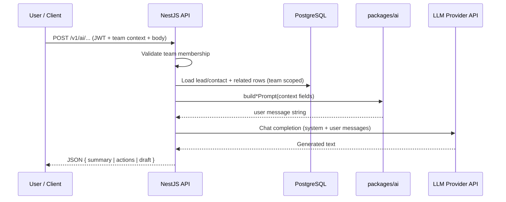

# Product Requirements Document — Microlead CRM

**Document type:** Product Requirements Document (PRD)  
**Product name:** Microlead CRM (`microlead-crm`)  
**Status:** Living document — aligned with current monorepo implementation  
**Last updated:** April 2026

**Implementation status (April 2026):** **Backend / API MVP** is complete (auth, team-scoped CRUD, activities, search, attachments API, three AI routes, `/v1`, CI smoke tests). **Web app MVP** (PRD §10.1b) is shipped: shell, auth, dashboard, companies/contacts/leads CRUD, pipeline kanban, lead/contact/company detail, activity timelines, tasks, command bar, team switcher, AI actions in UI. **Advanced AI** (PRD §7.7.1–7.7.3 / §10.2 — cached summaries, multi-provider, agents, semantic search) remains on the roadmap. Granular steps: [`planning/development-plan.md`](../planning/development-plan.md).

---

## 1. Executive summary

Microlead CRM is a **modern, AI-assisted customer relationship management product** for **micro-SaaS founders, agencies, and small B2B sales teams** (roughly 1–20 people). It delivers **team-isolated workspaces**, fast capture of **companies, contacts, and leads**, a **visual pipeline (kanban)**, and **task, note, and activity history** — with **first-class assistance from large language models (LLMs)** grounded in each team’s own CRM data.

The product prioritizes **clarity, speed, and honest scope**: core CRM workflows without enterprise bloat, a **versioned REST API**, and **real provider-backed AI** (not placeholder copy).

**Roadmap stance:** After the core MVP ships, Microlead is designed to grow into **deeper AI** — **cached summaries with usage metadata**, **rich context across companies, contacts, and leads**, a **multi-provider LLM abstraction**, and **standards-based agent connectivity** (tools, resources, and prompts) so assistants and automation can work **safely inside team boundaries**.

---

## 2. Problem statement

Small teams selling B2B services or software often juggle spreadsheets, disjointed inboxes, and generic CRMs that are either too heavy or too shallow. They need:

- **Shared visibility** on who is working which deal, in which stage, with what history.
- **Low friction** to add accounts, people, and opportunities.
- **Actionable help** to summarize context, suggest next steps, and draft outreach — **without** leaking data across customers or teams.

Microlead addresses this by combining **strict multi-tenant team scoping** with **context-aware LLM features** that read only the authenticated team’s records.

---

## 3. Goals and non-goals

### 3.1 Product goals

1. **Credible MVP:** Auth, teams, full CRM CRUD for core entities, kanban pipeline, activity timeline, search, and **three working AI endpoints** backed by a real LLM API.
2. **Trust boundaries:** Every business operation is scoped by `teamId`; cross-team access is denied by design.
3. **Extensibility:** Stable JSON API (`/v1`) for the web app and future clients (mobile, integrations, automation).
4. **Maintainable AI:** Prompt construction lives in a shared package; the API assembles **sanitized context** and calls the provider behind a thin boundary.
5. **Advanced AI track (post-MVP):** Persistent summaries, broader record-type coverage, pluggable models, and **agent-facing protocols** delivered in **phased** milestones with strict tenancy and observability.

### 3.2 Non-goals (default scope)

- Enterprise CPQ, territory management, or highly customizable field systems unless explicitly expanded.
- Shipping a **large** tool surface (many CRUD tools, resources, and prompts) in the **first** release; v1 may expose **three REST AI actions** only, with a **documented path** to a fuller agent integration in later phases.
- Replacing human judgment: AI outputs are **assistive** and require user review before sending or committing decisions.

---

## 4. Target users (ICP)

| Segment             | Needs                                                     |
| ------------------- | --------------------------------------------------------- |
| Micro-SaaS founders | Lightweight pipeline, notes, quick summaries before calls |
| Agencies            | Multiple deals per account, tasks per lead/contact        |
| Lean sales teams    | Shared workspace, activity history, consistent API        |

**Assumptions:** Users are comfortable with self-serve SaaS, care about **data isolation per workspace**, and accept that AI features depend on **optional provider configuration** (API keys, model choice).

---

## 5. Product overview

### 5.1 Core concepts

- **Team (workspace):** The tenant boundary. All CRM entities belong to exactly one team.
- **User:** Authenticated identity; membership links users to one or more teams.
- **Company:** Organization / account.
- **Contact:** Person; optionally linked to a company.
- **Lead:** Opportunity or deal; has a **pipeline stage**, owner, priority/score, optional value.
- **Pipeline stage:** Ordered stages per team; drives kanban columns.
- **Task:** Work item attached to a lead, contact, or company (one parent per task in service logic).
- **Note:** Free text on the same parent model as tasks.
- **Activity:** Append-only audit trail for important changes (timeline on records).
- **Attachment:** Files linked to records; storage can be local or S3-compatible in production configurations.

### 5.2 Primary user journeys (MVP)

1. **Onboard:** Register → create or join a team → land on the app dashboard.
2. **Capture:** Create company and contact → create lead in a stage → assign owner.
3. **Pipeline:** View leads on a kanban board; move between stages; see stage changes in activity history.
4. **Follow-up:** Add tasks and notes; use search / command patterns to jump to records (API search exists; full UI polish may follow).
5. **AI assist:** From a lead (or contact, for next actions), request **summary**, **suggested next steps**, or **outreach draft** — generated from **that record’s CRM context** only.
6. **Advanced AI (later):** Open a record and see a **stored AI summary** (refreshed on demand); use **connected assistants** via a **standard agent protocol** to query pipeline health, list records, and create or update entities — all **team-scoped** and **auditable**.

---

## 6. Functional requirements

### 6.1 Authentication and teams

- Users authenticate (e.g. JWT-based session for API clients).
- **Team context** is resolved on each request (e.g. active team in token and/or `X-Team-Id` header pattern) and **verified membership** before any domain logic.
- All queries for CRM data include `teamId` — no implicit cross-team reads.

### 6.2 CRM operations

- **CRUD** for companies, contacts, leads, pipeline stages, tasks, and notes (with soft delete where it improves UX and data hygiene).
- **Leads** support stage assignment, owner, priority, optional monetary value, and relations to company/contact as modeled in the schema.
- **Activities** record key mutations and stage transitions; **no** public “forge activity” API — timeline is system-driven.

### 6.3 Search and navigation

- List views support **filtering** appropriate to each entity.
- **Search API** enables quick lookup across records for navigation and future command-bar UX.

### 6.4 Attachments

- Upload and associate files with CRM records.
- MVP-friendly **local storage** with a path configurable via environment; abstraction allows **S3-compatible** backends for production.

### 6.5 API surface

- **Versioned REST** under `/v1` with consistent validation and error shapes.
- Resources return **stable DTOs** suitable for web and third-party consumers.

---

## 7. AI and LLM integration — product behavior and technical flow

This section is the **canonical description** of how Microlead uses AI: what it does for users, what data it sees, and how the system is structured.

### 7.1 Product principles for AI

1. **Grounding in CRM context:** The LLM does not invent a private database. It receives **only** text assembled from the current team’s records (lead, related company/contact, recent notes, open tasks where applicable).
2. **Team isolation:** AI handlers load entities with `teamId` and `deletedAt` rules identical to non-AI endpoints. A user cannot summarize another team’s lead by ID.
3. **Optional availability:** If no LLM API key is configured, AI endpoints return a clear **“not configured”** response so the rest of the CRM remains usable.
4. **Human in the loop:** Summaries, action lists, and drafts are **suggestions**. The product must not auto-send email or auto-update pipeline solely from model output unless explicitly designed later with safeguards.

### 7.2 User-facing AI capabilities (MVP)

| Capability         | User value                                         | Primary input context                                                                     |
| ------------------ | -------------------------------------------------- | ----------------------------------------------------------------------------------------- |
| **Lead summary**   | Fast briefing before a call or standup             | Lead title, stage, company, contact, value, priority, recent notes                        |
| **Next actions**   | Concrete follow-ups aligned with open work         | For leads: stage, open tasks, recent notes. For contacts: open tasks, recent notes        |
| **Outreach draft** | Starting point for email or short LinkedIn message | Lead title, company, contact, stage, channel (email vs LinkedIn), tone guidance in prompt |

### 7.3 API contract (conceptual)

All AI routes are **POST** endpoints under an `ai` controller namespace, protected by the same **team guard** as the rest of the app:

- **`lead-summary`** — Body: `leadId` (UUID). Response: `{ summary: string }`.
- **`next-actions`** — Body: `leadId` and/or `contactId` (at least one required). Response: `{ actions: string }`.
- **`outreach-draft`** — Body: `leadId`, optional `channel` (`email` | `linkedin`, default `email`). Response: `{ draft: string }`.

Errors include: not found (wrong ID or wrong team), bad request (missing identifiers), service unavailable (AI not configured), bad gateway (empty or failed provider response).

### 7.4 How it works — end-to-end flow

**Step-by-step:**

1. **Authentication and team resolution** — Same as standard CRM requests.
2. **Context assembly (server-side only)** — Services query Prisma for the lead (including stage, company, contact) and a **bounded** set of recent notes (e.g. last N). For “next actions” on leads, **open tasks** titles are included. Contact-only path loads contact tasks and notes similarly.
3. **Prompt building** — The shared `packages/ai` module exports **pure functions** that take structured context (titles, names, stage, notes array, etc.) and return a single **user** message string. This keeps controllers thin and makes prompts **reviewable and testable** in one place.
4. **System instructions** — Short, role-specific system strings (e.g. “concise B2B sales assistant”, “sales coach”, “human outreach writer”) steer format (bullets, numbered actions, subject line rules for email).
5. **Provider call** — The API uses a configured SDK (e.g. OpenAI) with:
   - **API key** from environment (required for AI to work).
   - **Model** from environment with a sensible default (e.g. a cost-effective chat model).
6. **Response handling** — Trim whitespace; reject empty model output with an error mapped to **502 Bad Gateway** so clients can retry or show a failure state.
7. **Return to client** — Plain text in JSON fields; the web app (when wired) can render markdown or plain text according to UX decisions.

### 7.5 Configuration

| Variable         | Purpose                                                                      |
| ---------------- | ---------------------------------------------------------------------------- |
| `OPENAI_API_KEY` | Credentials for the LLM provider; absence disables AI with a clear API error |
| `OPENAI_MODEL`   | Overrides default chat model for all AI endpoints                            |

**Phase 2+ (illustrative — names may differ in implementation):**

| Variable                                      | Purpose                                                                               |
| --------------------------------------------- | ------------------------------------------------------------------------------------- |
| `AI_PROVIDER` / per-provider keys             | Select backend and supply credentials (multiple providers supported via abstraction). |
| `AI_SUMMARY_MODEL`, `AI_DRAFT_MODEL`          | Different models for cached summaries vs outreach (cost/quality tradeoff).            |
| `MCP_SERVER_ENABLED`, `MCP_BASE_PATH` or host | Toggle and route agent protocol endpoint.                                             |
| `AI_SUMMARY_CACHE_TTL_SECONDS`                | TTL for aggregated CRM summary resource and similar cached reads.                     |

### 7.6 Observability, safety, and privacy

- **Do not** log full prompts or completions in production without an explicit privacy policy — they contain customer and prospect information.
- **Rate limiting** on AI endpoints is recommended once usage grows (same abuse surface as any expensive API).
- **Agent protocol traffic** must be **logged at metadata level** (tool name, record type, latency, error class) without storing full argument payloads unless required for compliance.
- **Content policy:** Rely on provider safety layers; product copy should remind users to **review** drafts before sending.

### 7.7 Phase 2+ — Advanced AI and LLM capabilities

The following extends Microlead beyond on-demand REST completions. Treat it as **product intent**; implementation may roll out incrementally (schema migrations, new modules, feature flags).

#### 7.7.1 Persistent, cacheable record summaries

**Problem:** Regenerating a full summary on every page load increases **latency and cost** and produces **inconsistent** copy if the model drifts.

**Requirements:**

- **Polymorphic storage** of AI summaries keyed by `teamId` and **one CRM record** (company, contact, or lead). One active summary row per record (replace on regenerate).
- **Fields:** summary text, `model_used`, `prompt_tokens`, `completion_tokens` (integers), timestamps — for **cost attribution**, debugging, and admin dashboards.
- **API behavior:**
  - `GET`-style read returns **cached** summary when present and `regenerate=false` (or equivalent query flag).
  - **Regenerate** path deletes or supersedes the prior row, runs context assembly → LLM → persist → return.
- **Invalidation (optional):** Worker or synchronous hooks when **material** data changes (new note, stage change, high-value field update); configurable policy (TTL-only vs event-driven).

#### 7.7.2 Universal record context builder

**Goal:** One internal pipeline assembles **structured context** for any supported entity before any AI feature (summary, coaching, drafting, or agent tools).

**Context shape (conceptual)** — always **team-scoped**, **bounded**, and **serializable to text** for the LLM:

| Entity      | Include (non-exhaustive)                                                                                                                                                                                              |
| ----------- | --------------------------------------------------------------------------------------------------------------------------------------------------------------------------------------------------------------------- |
| **Company** | Name; account owner; related **counts** (contacts, leads, notes, tasks); **recent** notes and tasks (capped, e.g. 10); optional **rollup** of open leads (titles, stages, values); created/updated hints for recency. |
| **Contact** | Name; linked company; recent notes/tasks (capped); counts; recency.                                                                                                                                                   |
| **Lead**    | Title; stage; company and contact; value/priority; recent notes/tasks (capped); recency.                                                                                                                              |

**Rules:**

- **Hard caps** on related rows included in the prompt (same idea as a fixed “relationship limit”) to control tokens and PII surface.
- **Strip or normalize** rich text (HTML/markdown) in note bodies before sending to the model.
- **System prompt variants** per feature: e.g. **short prose** (2–3 sentences, scannable) vs **bulleted** executive brief — selectable per endpoint or per workspace setting.

#### 7.7.3 Multi-provider LLM abstraction

**Goal:** Teams and deployments can choose **cloud chat APIs** or **self-hosted** inference without rewriting domain logic.

**Requirements:**

- **Provider interface** in the API layer: `complete({ system, user, model?, temperature? }) → { text, usage? }`.
- **Configuration:** API keys and base URLs per provider via environment (and optionally per-team secrets in a managed offering).
- **Supported classes of backends (product target):** major hosted chat APIs; **local/self-hosted** OpenAI-compatible endpoints; optional **separate models** for “cheap summary” vs “high-quality draft.”
- **Health and readiness:** Admin or automated **connectivity check** (lightweight completion or model list) so operators detect misconfiguration before users do.
- **Fallback policy (optional):** Primary provider failure → secondary provider with same prompt envelope (documented, not silent).

#### 7.7.4 Agent and assistant integration (standard protocol)

**Goal:** External LLM clients (desktop assistants, IDE agents, automation runners) interact with Microlead through a **documented, machine-consumable** surface — same **tenant and auth** model as the REST API.

**Recommended approach:** Implement a **Model Context Protocol (MCP)**-compatible server (or equivalent) that exposes:

**Tools (examples — full set phased in):**

- **Read:** list/get companies, contacts, leads, tasks, notes with **filters** (e.g. search by name) and **pagination**.
- **Write:** create, update, soft-delete the same entities; validate IDs and **team membership** on every call.
- **Utility:** “who am I / current team” for session debugging.

**Resources (examples):**

- **`crm/summary` (JSON):** Aggregated **counts**; **pipeline breakdown** by stage (lead counts and, where available, **weighted value**); **task health** (e.g. overdue, due this week); note totals — optimized for “how is the business doing?” questions. Responses may be **short-TTL cached** (e.g. ~60s) to protect the database.
- **Schema resources:** Machine-readable descriptions of entities and fields so agents **ground** tool calls correctly.

**Prompts (examples):**

- **`crm_overview`:** Pre-composed text with **record counts** and **recent** company/contact names, ending with guidance to use tools for detail — gives models a **cheap first turn** without hammering list endpoints.

**Cross-cutting requirements:**

- **Authentication:** Same user identity as the web/API; **personal access tokens** or OAuth-style flows with **scoped abilities** (e.g. read-only vs read-write).
- **Team context:** Every tool invocation resolves **exactly one** active workspace (header, claim, or session), identical to REST.
- **Rate limiting:** Dedicated throttle namespace for agent traffic (stricter than interactive UI where appropriate).
- **Audit and provenance:** Persist **`creation_source`** (or equivalent) on records created via agents vs UI vs import — critical for support and analytics.
- **Deployment:** Optional **dedicated host or path** for the agent endpoint; ability to **disable** it globally via config when not needed.

#### 7.7.5 Async and retrieval-augmented features

- **Worker jobs:** Scheduled or event-driven **summary refresh**, **bulk embedding** of notes, **import** pipelines.
- **Semantic search:** Vector index over note bodies (and later attachments or emails) with **hybrid** keyword + similarity search in the main search API.
- **RAG for AI:** Optional retrieval step that pulls top-k relevant notes **before** completion for Q&A-style “ask this lead” experiences (still team-scoped).

#### 7.7.6 Governance

- **Cost controls:** Per-team daily/monthly **token or request budgets** (soft cap with warnings; hard cap optional).
- **Data residency:** Document which fields are sent to which provider class (cloud vs self-hosted).
- **Retention:** Configurable **deletion** of cached summaries when a record is destroyed or on GDPR-style erasure.

---

## 8. Technical architecture summary

- **Monorepo:** pnpm + Turborepo.
- **Web:** Next.js (App Router), TanStack Query, forms with Zod; query keys should include `teamId` when switching workspaces.
- **API:** NestJS modules per domain; Prisma for PostgreSQL.
- **Worker:** Redis + BullMQ for asynchronous work (imports, embeddings, summary invalidation, future AI maintenance jobs).
- **Shared packages:** `packages/ai` for prompts; `packages/shared` for types/schemas; `packages/ui` for shared UI.
- **Advanced:** Optional **agent protocol** app or module (alongside Nest) sharing Prisma and auth; **vector store** or pgvector when semantic search ships.

Detailed diagrams and module boundaries: see `architecture.md`.

---

## 9. Success metrics (suggested)

| Metric                                                       | Why it matters              |
| ------------------------------------------------------------ | --------------------------- |
| Time to first lead created                                   | Onboarding friction         |
| Weekly active teams                                          | Retention signal            |
| AI endpoint usage rate (among configured workspaces)         | Feature adoption            |
| AI error rate (4xx/5xx, empty responses)                     | Reliability of integration  |
| P95 API latency on core list/detail endpoints                | Perceived speed             |
| Cached summary **hit rate** vs regenerate                    | Cost and UX efficiency      |
| **Token usage** (prompt + completion) per team / per feature | Billing and abuse detection |
| Agent tool **call volume** and failure rate                  | Integration health          |

Exact targets should be set per launch phase.

---

## 10. Release criteria

### 10.1 “Credible MVP”

MVP is tracked in two bars so **API-complete** work is not confused with **end-user UI** readiness.

#### 10.1a Backend / API (MVP bar)

- [x] Auth + team-scoped workspaces enforced on all business routes (`TeamGuard`, JWT, `X-Team-Id`).
- [x] Full REST CRUD for companies, contacts, leads, tasks, notes; pipeline stages; kanban data via `GET /leads/kanban` and stage updates via `PATCH /leads/:id`.
- [x] Activity timeline **data plane**: append-only activities on mutations + `GET` activities for parents (`apps/api` domain services).
- [x] Search API functional for navigation use cases (`/v1/search`).
- [x] Attachments: upload, download, delete (local storage; S3-ready abstraction path in product scope).
- [x] **Three AI endpoints** operational with real LLM provider when configured (`POST /v1/ai/*`, `packages/ai` prompts).
- [x] Versioned REST API under `/v1` documented at a high level (`docs/api-design.md`).
- [x] Basic automated tests on API health / critical paths; CI running on changes (`apps/api/test`, root CI workflow).

#### 10.1b Web app (MVP bar)

- [ ] Full **create/edit** flows (forms) for companies, contacts, leads, tasks, notes — not only list views.
- [ ] **Lead detail** (and **contact detail**) with sections for related data.
- [ ] **Activity timeline** visible on key record detail screens (consume activities API).
- [ ] **Contacts** area in nav + list (and detail).
- [ ] **Tasks** page or equivalent surfaced in UI.
- [ ] **Command / search bar** (global quick finder using search API).
- [ ] **AI actions in UI** (summary, next actions, outreach) with loading/error states.
- [ ] **Team switcher** wired to preferred team (`PATCH /v1/users/me/preferred-team` or equivalent), not only displaying a team id.

### 10.2 Advanced AI / agent track (post-MVP milestones)

Ordered milestones for implementation: see [`planning/development-plan.md`](../planning/development-plan.md) (post-MVP section maps to PRD §7.7.1–7.7.6).

- [ ] **Polymorphic `AiSummary` (or equivalent)** with regenerate + token metadata; UI surfacing on company, contact, and lead.
- [ ] **Shared record context builder** with documented caps and entity coverage.
- [ ] **Provider abstraction** + at least **two** backends (e.g. one cloud + one OpenAI-compatible local URL) behind the same interface.
- [ ] **MCP server** (or equivalent) with **read** tools + **CRM summary** resource; **write** tools behind scoped tokens.
- [ ] **Worker-driven** embedding pipeline OR semantic note search (pick one as first vertical).
- [ ] **Operational:** provider health check; agent endpoint throttle; `creation_source` (or equivalent) on agent-created rows.

---

## 11. Open questions

1. **UI surfacing for AI:** Placement on lead detail (buttons vs. side panel vs. command palette).
2. **Retention of AI outputs:** Store last summary on the lead vs. generate on demand only (storage, compliance, and cost tradeoffs).
3. **Roles:** Team admin vs. member capabilities for billing, invites, and data export.
4. **Summary invalidation:** Time-based TTL only vs event-driven refresh on note/stage changes — impact on cost and freshness.
5. **Agent tokens:** Separate PAT issuance UI, rotation, and **read vs read-write** scopes per team.
6. **MCP deployment:** Path-based vs subdomain-based agent endpoint and SSO implications.

---

## 12. Document maintenance

When scope changes, update this PRD and record **decision rationale** in `decisions.md`. Keep **user-facing promises** here aligned with **actual routes and services** in `apps/api` and **prompts** in `packages/ai`.

- Keep **§10** release checkboxes in sync with [`planning/development-plan.md`](../planning/development-plan.md) (step-by-step status) and [`docs/roadmap.md`](roadmap.md) (phase checkboxes).
