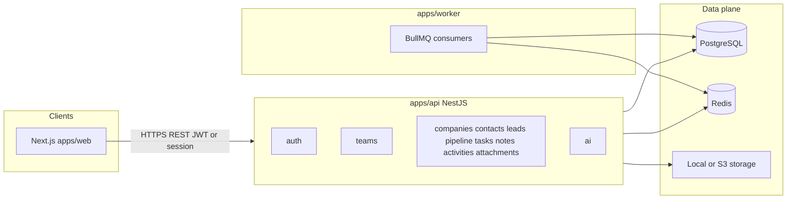

# Architecture — microlead-crm

## System overview



## Monorepo layout

```
microlead-crm/
  apps/web        — UI, TanStack Query, RHF+Zod
  apps/api        — NestJS, Prisma, domain modules
  apps/worker     — BullMQ job processors
  packages/shared — types, zod schemas, job payloads
  packages/ai     — prompts + provider-agnostic interfaces
  packages/ui     — shared UI primitives
  packages/config — eslint/tsconfig
  docs/           — this documentation
  infra/          — optional Docker compose, deploy notes
```

## Request flow (API)

1. **Transport:** HTTPS; JSON body/query.
2. **Auth:** JWT bearer or session cookie (see `decisions.md`).
3. **Team context:** Resolve `teamId` (header and/or token claim); verify membership.
4. **Authorization:** Role checks for team admin actions; entity loads always include `teamId`.
5. **Domain service:** Validation → transaction → Prisma → activity log.
6. **Response:** Stable DTO shape; consistent error envelope.

## Domain modules (Nest)

Each module should include:

- DTOs / validation
- Service (business logic)
- Controller
- Persistence (repository or direct Prisma — pick one pattern repo-wide)
- Tests

Required modules: `auth`, `teams`, `companies`, `contacts`, `leads`, `pipeline`, `tasks`, `notes`, `activities`, `ai`; **`attachments`** as storage-bound module.

## Activity log

Append-only rows on key CRUD and stage transitions; **no** public create endpoint. Read API for timelines.

## AI module

- **Context assembly** in `apps/api` (load lead, related entities, recent notes/tasks).
- **Prompt strings / templates** in `packages/ai`.
- **Provider calls** behind interface implemented in API (Vercel AI SDK or direct SDK).

## Worker

- Redis-backed queues for non-request work: e.g. summary refresh, future imports, embeddings.
- Shares env and Prisma schema with API where appropriate.

## Frontend

- Next.js App Router; feature folders or colocation per route segment.
- TanStack Query keys include `teamId` to avoid cache bleed when switching workspace.

## Security principles

- Deny by default on cross-team access.
- Rate-limit auth endpoints.
- Never log raw PII or full AI prompts in production without policy.
